# Paper Summary  
- ## (*ECCV2018_SCAN*) Stacked Cross Attention for Image-Text Matching. [[paper](https://openaccess.thecvf.com/content_ECCV_2018/papers/Kuang-Huei_Lee_Stacked_Cross_Attention_ECCV_2018_paper.pdf)] [[code](https://github.com/kuanghuei/SCAN)]  
    - ### 思路  
        首先对图片中的区域(region)和句子中的单词(word)进行编码并将它们映射到相同的嵌入空间(embedding space)，然后通过Stacked Cross Attention 进行regions和words的对齐，求出图片和句子的相似度。  
    - ### Motivation  
        先前的工作大多是先求出图片中的每个region和句子中的每个word的相似度，然后将结果聚合起来作为图片和句子的相似度，但不同的区域或单词的重要程度是不一样的。本文最大的创新/贡献就是引入了Stacked Cross Attention机制，使用regions和words互为上下文进行attention操作，来考虑不同区域或单词的重要程度。  
    - ### Stacked Cross Attention  
        本文给出了两种SCA方案：Image-Text SCA 和 Text-Image SCA，此处主要介绍 Image-Text SCA.  
        SCAN有两个输入：图片特征V={v1, ..., vk}和句子特征E={e1, ..., en}，其中vi表示图片第i个region的特征，ej表示句子第j个单词的特征，vi和ej维度相同。  
        - #### Image-Text Stacked Cross Attention  
            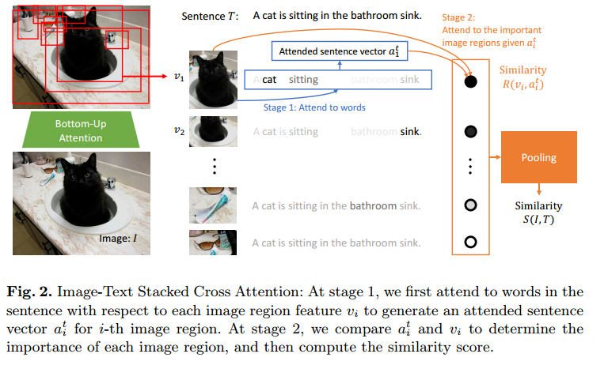  
            - ##### 第一阶段：以图像区域作为上下文来attend句子中的单词  
                计算每一个region和每一个word的余弦相似度：  
                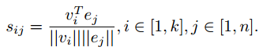  
                对相似度矩阵进行归一化处理：  
                  
                计算对于图片中的第i个区域，句子中的第j个单词在整个句子中的重要程度，即注意力分数：  
                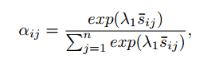 注：λ1为softmax函数[温度参数](https://zhuanlan.zhihu.com/p/132785733)的倒数。  
                对句子中的所有单词加权求和得到句子向量，得到的句子向量就考虑了每个单词的重要程度：  
                  
            - ##### 第二阶段：以句子作为上下文来attend图片中的区域  
                计算图片中的每个区域和其对应的句子向量之间的相似度：  
                  
            - ##### 计算整张图片和整个句子的相似度  
                文中给出了LogSumExp pooling(LSE)和average pooling(AVG)两种方式计算图片和句子的相似度，分别为：  
                  
                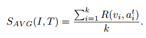  
                注：LSE中的λ2用来提高 R大的项的重要性，当 λ2 → 无穷大时，S(I, T)就近似等于最大的R.  
        - #### Text-Image Stacked Cross Attention  
              
            与第一种方案类似，不再赘述。  
    - ### Alignment Objective  
        使用[triplet loss](https://www.bilibili.com/video/BV1SW411G7Yg?p=39)作为总的损失函数来训练模型：  
        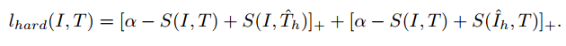  
        负样本的选取方式如下：  
         &nbsp; 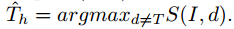  
        即选取除了当前正例之外相似度最高的图或文作为负样本。  
    - ### 特征提取  
        图片特征：Faster R-CNN + ResNet-101  
        文本特征：bidirectional GRU  

- ## (*ACMMM2019_BFAN*) Focus Your Attention: A Bidirectional Focal Attention Network for Image-Text Matching. [[paper](https://arxiv.org/pdf/1909.11416.pdf)] [[code](https://github.com/CrossmodalGroup/BFAN)]  
    - ### Motivation  
        之前的工作中都是计算每个region-word的注意力分数，但忽略了实际上存在着许多语义不相关的region-word这一事实(比如图片有一个region是一个狗头，它和单词cat就是不相关的)。而在之前的方法中，语义不相关的region-word也会有一个注意力得分，虽然它得到的注意力很少，但或多或少都会影响最终结果，造成语义不对等现象。为了解决这个问题，本文提出了BFAN，排除语义不相关的region-word的注意力，把所有的注意力全部都转移到语义相关的region-word上。  
        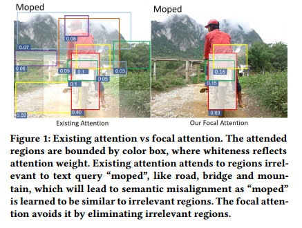  
    - ### Bidirectional Focal Atention Network  
          
        - #### Text-to-Image Focal Attention  
            1. 预分配注意力：对于句子中的一个单词，去计算图片中的每一个区域和该单词的相似度，并基于此得到每个区域的注意力分数；  
            2. 根据图片的每个区域得到的注意力分数，决定排除哪些区域(被排除的区域被认为和该单词语义不相关)；  
            3. 重新分配注意力：对留下的区域(被认为和该单词语义相关)重新分配注意力。  
        - #### Image-to-Text Focal Attention  
            与前者类似，不再赘述。  

- ## (*IJCAI2019_PFAN*) Position Focused Attention Network for Image-Text Matching. [[paper](https://arxiv.org/ftp/arxiv/papers/1907/1907.09748.pdf)] [[code](https://github.com/HaoYang0123/Position-Focused-Attention-Network)]  
    - ### Motivation  
        每个region在图片中的相对位置对于理解图片语义有一定的帮助，一般来说图片中间的region可能比边缘的region更能表达图片的主要语义(如下图a)，但这也不是绝对的(如下图b)，所以如果只简单地将注意力着重分配到靠中间的region并不合理。基于以上观察，本文提出为每个region设置一个位置特征来融合其在图片中的相对位置信息，并提出一种注意力机制来为每个region生成实值的位置特征。  
          
    - ### PFAN整体架构  
        除了Position Focused Attention之外，其余部分与SCAN一样。  
          
    - ### 如何编码region的位置信息  
          
        1. 将整张图片分成K*K个blocks，每个block都有一个索引编号k，k∈[1, K2]，K2个blocks构成一个词典，每个block用one-hot表示，经过Embedding后得到block embedding；  
        2. 对于图片的某个region，找到前L个与其重叠最多的block，重叠的像素的数量视为这个block的重要程度(注意力分数/权重)；  
        3. 但在某一个region内，某些block会被完全覆盖，导致这几个block的权重相同，但我们希望每一个block的权重都互不相同以获得更加细粒度的信息，所以重新计算每个block的权重，最后将这L个blocks加权求和就得到对应region的位置编码。  

- ## (*AAAI2020_DP-RNN*) Expressing Objects just like Words: Recurrent Visual Embedding for Image-Text Matching. [[paper](https://arxiv.org/pdf/2002.08510.pdf)]  
    - ### Motivation  
        在之前的工作中都是仅考虑了图片中的单个object和句子文本的关系，而本文考虑到，有时图片中的多个objects之间是有关联的，要对这些相互关联的objects联合建模才能确定其与句子文本的关系。如在下图中，要联合这些绿框框起来的objects的语义，才能确定图上是"Two people"，从而达到更好的图文匹配效果。  
          
    - ### Method  
        本文提出Dual Path Recurrent Neural Network(DP-RNN)，以RNN分别处理图像和文本特征，故称为双路RNN。**本文最大的创新点在于用RNN来处理图像特征，关联起了图像的regions之间的关系。**  
          
        **Cross Matching with Multi-attention**: 该过程总体与SCAN一致，只是额外计算了一个"word attention"和"object attention"，最后计算图文相似度的时候要用其进行加权，具体看论文。  
        **Recurrent Visual Embedding**: 对图片的regions根据其各自最相关的word在句子中的位置进行重排序(该过程要在"word attention"之后才能做)，然后将重排序好的regions输入到RNN(Bi-GRU)中，每个GRU单元的输出作为新的region feature(目的是为了建模regions之间的关联)。  
    - ### 训练策略  
        多阶段训练：第一阶段训练Multi-attention Cross Matching部分；第二阶段将Recurrent Visual Embedding加到网络中，训练这一部分，而第一阶段训练好的参数不动；第三阶段训练整个网络，更新所有参数。  

- ## (*CVPR2020_IMRAM*) IMRAM: Iterative Matching with Recurrent Attention Memory for Cross-Modal Image-Text Retrieval. [[paper](https://openaccess.thecvf.com/content_CVPR_2020/papers/Chen_IMRAM_Iterative_Matching_With_Recurrent_Attention_Memory_for_Cross-Modal_Image-Text_CVPR_2020_paper.pdf)] [[code](https://github.com/HuiChen24/IMRAM)]  
    *这篇论文在跨模态图文检索中性能比较靠前*  
    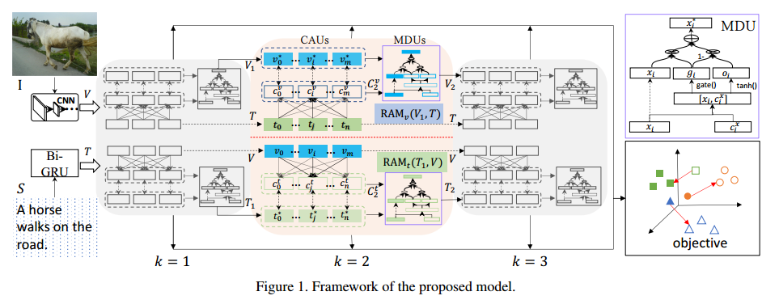  
    - ### Motivation  
        图文之间的语义关系通常是很复杂的，仅通过一轮匹配来对齐图文间的语义关系是不够的。基于以上想法，本文提出了IMRAM，通过迭代多次匹配来对齐图文间的语义(个人理解迭代是一个从粗粒度到细粒度、从低层语义到高层语义的过程)。  
    - ### Method  
        改进的重点是在SCAN的基础上加了一个Memory Distillation Unit(MDU)，用来在每一次对齐后对query feature X进行更新优化以使得在下一次对齐过程中得到更好的结果，详见论文。  
          

- ## (*IJCAI2021_SHAN*) Step-Wise Hierarchical Alignment Network for Image-Text Matching. [[paper](https://arxiv.org/pdf/2106.06509.pdf)]  
    - ### Motivation  
        仅进行local-to-local(即regions和words)层次的交互，可能会丢失一些上下文的语义信息，如下图。为解决上述问题，本文提出SHAN来进行图文之间的多层次交互：local-to-local -> global-to-local -> global-to-global.  
          
    - ### Method  
          
        1. Fragment-level L2L Alignment  
        2. Context-level G2L Alignment  
        3. Context-level G2G Alignment  

- ## (*CVPR2020_MMCA*) Multi-Modality Cross Attention Network for Image and Sentence Matching. [[paper](https://openaccess.thecvf.com/content_CVPR_2020/papers/Wei_Multi-Modality_Cross_Attention_Network_for_Image_and_Sentence_Matching_CVPR_2020_paper.pdf)]  
      
    **Self-Attention Modules**：单模态内部进行交互，建模各部分之间的关联，以此获得更好的单模态表征，用于global-to-global级别的匹配；  
    **Cross-Attention Module**：跨模态交互/对齐，图片的regions和文本的words之间进行交互/对齐，用于local-to-local级别的匹配。  
    **图文相似度分数计算方式**： S(I, T) = i0 · c0 + α (i1 · c1)，α 用来权衡两种注意力机制的影响。  

- ## (*CVPR2020_CAAN*) Context-Aware Attention Network for Image-Text Retrieval. [[paper](https://openaccess.thecvf.com/content_CVPR_2020/papers/Zhang_Context-Aware_Attention_Network_for_Image-Text_Retrieval_CVPR_2020_paper.pdf)]  
    本篇论文通过一大堆的矩阵运算将模态间注意力(inter-modal attention)和模态内注意力(intra-modal attention)结合在一起来进行图文匹配，并且它提出了一个semantics-based attention(SA)机制来进行intra-modal attention，SA提供了一种新思路就是**将跨模态交互服务于单模态内的特征融合**。[知乎](https://zhuanlan.zhihu.com/p/376541921)有一篇解读本论文的文章。  

- ## (*SIGIR2021_DIME*) Dynamic Modality Interaction Modeling for Image-Text Retrieval. [[paper](https://liqiangnie.github.io/paper/SIGIR21_quleigang.pdf)] [[code](https://github.com/LgQu/DIME)]  
    知乎有几篇关于该论文的介绍：[1](https://zhuanlan.zhihu.com/p/402122260)、[2](https://zhuanlan.zhihu.com/p/395591953)、[3](https://zhuanlan.zhihu.com/p/405877757)。  

- ## (*ICCV2019_VSRN*) Visual Semantic Reasoning for Image-Text Matching. [[paper](https://arxiv.org/pdf/1909.02701.pdf)] [[code](https://github.com/KunpengLi1994/VSRN)]  
      
    - ### For the image part  
        - Image Representation by Bottom-Up Attention(as same as SCAN). -> V={v1, ..., vk}.  
        - Region Relationship Reasoning with GCN.  
            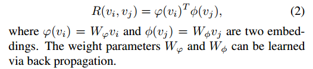  
            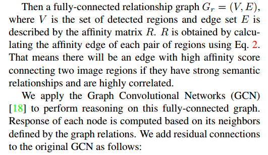  
            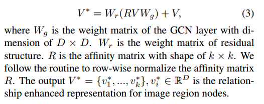  
        - Global Semantic Reasoning with GRU, the GRU's last memory cell as the final representation of the image.  
    - ### For the text caption part  
        - Learn a representation for the sentence using RNNs.  
    - ### Learning Alignments by Joint Matching and Generation  
          
        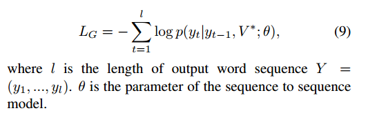  
          

- ## (*CVPR2021_GPO*) Learning the Best Pooling Strategy for Visual Semantic Embedding. [[paper](https://arxiv.org/pdf/2011.04305.pdf)] [[code](https://github.com/woodfrog/vse_infty)]  
    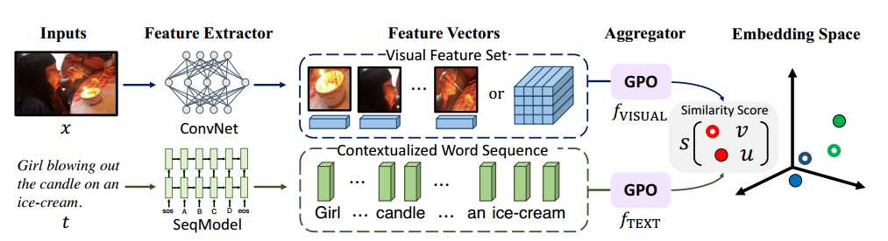  
    Visual Semantic Embedding(VSE)是跨模态检索中的常用方法，它旨在学习一个embedding space，将图片和文本都映射到这个空间中，希望具有相近语义的图片和文本在该空间中距离相近，上图是该方法的一个典型流程：输入图片和文本 -> 用特征提取器提取特征 -> 将提取到的特征聚合起来表示整张图片或整个句子 -> 在embedding space中计算图文相似度 -> 使用triplet loss更新模型。在先前的绝大多数工作中，特征聚合的过程都非常复杂（比如用各种Attention、GCN等），但**本文实验发现，在跨模态检索任务中，使用简单的池化(pooling)策略进行特征聚合，性能可以超越大多数花里胡哨的复杂模型**。现在问题就变成了如何自动地学习最优的池化策略，这就是本篇论文要解决的问题。  
    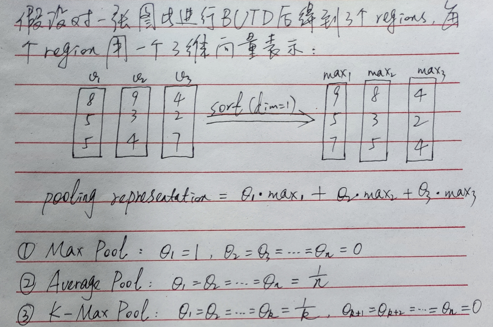  
    **如果θ可以取任意值，那么是不是就可以说明模型能够捕获一些我们未知但更适用于某特定任务的池化策略呢？这就是GPO的思想，即自动地去学习这些θ。**  
    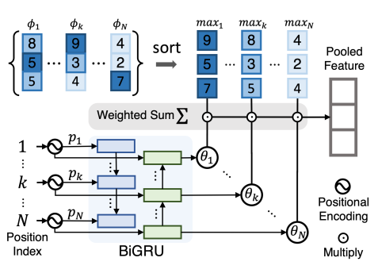  
    上图中φ1, ..., φN代表多个local表示（图片中就是region，文本中就是token）。考虑到对于文本来说每次输入都是不同长度的，所以要解决输入长度不固定的问题，基于此，本文作者使用了Bi-GRU去生成θ1, ..., θk各个系数。  
	Bi-GRU的输入采用和Transformer中一样的位置编码，如下：  
    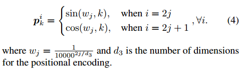  
    Bi-GRU的每个状态的输出接一个MLP，得到的就是对应位置的系数，如下：  
    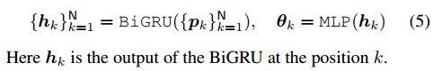  
    θ1, ..., θk确定后，就得到了最终的Pooled Feature.  
    在训练过程中，本文还提出了一个Size Augmentation：随机drop掉20%的input vectors来混淆input set的长度，以更好地适用于可变输入。  
       
    > **从实验结果来看，给人感觉就是，文中着重突出的GPO可能有用，但是对于结果提升帮助最大的似乎是将BUTD region features换成了WSL grid features.**  

- ## (*ACMMM2019_MTFN*) Matching Images and Text with Multi-modal Tensor Fusion and Re-ranking. [[paper](https://arxiv.org/pdf/1908.04011.pdf)] [[code](https://github.com/Wangt-CN/MTFN-RR-PyTorch-Code)]  
    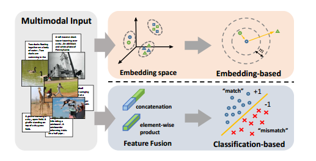  
    在图文匹配任务中，大致分为两种方法，如上图所示：一是将不同模态的特征映射到一个公共的embedding space中，然后在该空间中计算相似度或距离（常用余弦相似度或点积）；二是将不同模态的特征进行融合，然后将融合后的特征扔到一个神经网络中去做二分类。在本文中，作者结合了上述两种方法：先对不同模态的特征进行融合，然后将融合好的特征扔到神经网络中，让神经网络去学习一个相似度函数，其整体架构如下所示：  
    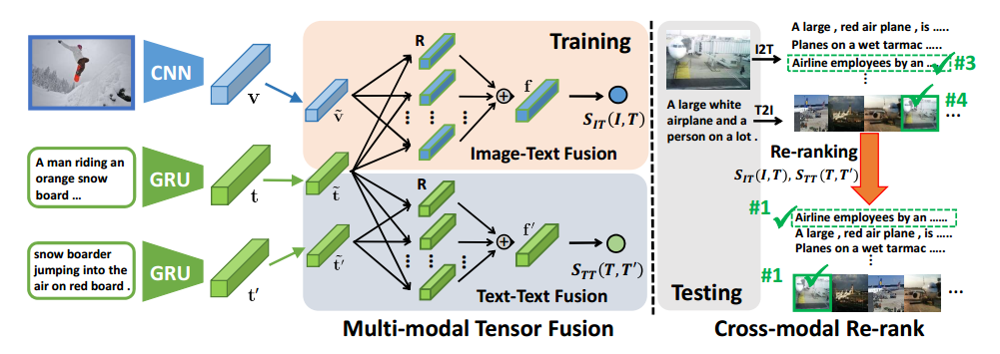  
    简单理解，本文中通过神经网络学习的相似度函数可以简单认为成下式：  
    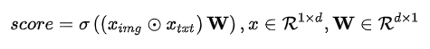  
    这其实和点积没有太大的区别，点积是将两个向量对应位置元素相乘，然后相加；而这里是将对应位置元素相乘后，与 W 做积，相当于做加权求和，而当 W 为全 1 矩阵时，这里的这个方式也就退化成了点积。现在就有了两个问题：  
    1. 一定可以学到比全 1 矩阵更好的 W 吗？  
    2. 因为 W 是学习出来的，我们学习好模型后 W 便不再变化，也就是说在 inference 时，对于任意一对图文特征的element-wise product，其中每个元素获得的权重都是相同的，这显然是不合理的。  

- ## (*CVPR2019_RAMEN*) Answer Them All! Toward Universal Visual Question Answering Models. [[paper](https://arxiv.org/pdf/1903.00366.pdf)] [[code](https://github.com/erobic/ramen)]  
    *这篇文章是做 VQA 的，但文中提到的**特征早融合(early fusion)方式**或许能对 image-text matching 提供一点启发。*  
    [借 VQA 来聊聊 Image-text matching - 知乎](https://zhuanlan.zhihu.com/p/100575464).  
    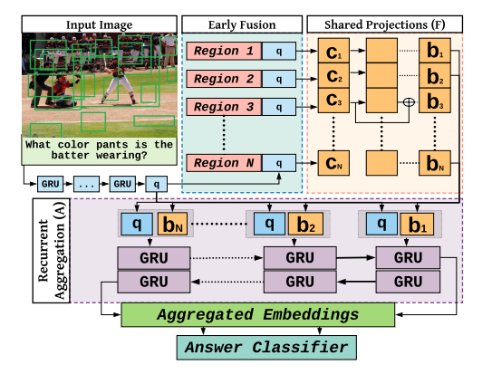  
    1. 通过GRU对句子提取特征得到文本特征q，使用BUTD得到图片每个region的特征regioni.  
    2. 特征早融合：将regioni和q拼接在一起，做BatchNorm后得到ci.  
    3. 将ci通过残差连接的MLP得到bi.  
    4. 将bi和q拼接在一起，送入Bi-GRU，将Bi-GRU每个方向的输出拼接起来，后接分类器进行分类.  

- ## (*ACMMM2019_SAEM*) Learning Fragment Self-Atention Embeddings for Image-Text Matching. [[paper](https://vipl.ict.ac.cn/uploadfile/upload/2019112611434332.pdf)] [[code](https://github.com/yiling2018/saem)]  
    *CVPR2020的那篇MMCA就是在该论文的基础上加上了一个 Cross-Attention Module.*  
    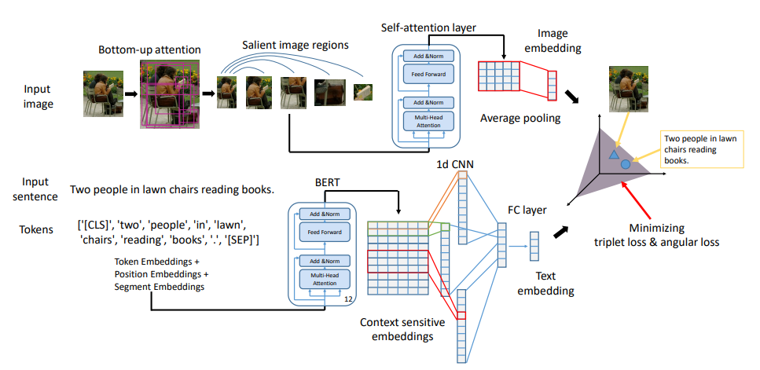  
    需要注意的是，该模型最后的损失函数是 triplet loss + angular loss，详见论文。  

- ## (*AAAI2021_SGRAF*) Similarity Reasoning and Filtration for Image-Text Matching. [[paper](https://arxiv.org/pdf/2101.01368.pdf)] [[code](https://github.com/Paranioar/SGRAF)]  
    - ### Motivation  
        - 以往的工作在计算两个向量的相似度时一般使用的是余弦相似度，所得结果是一个数值标量。然而相似性可以体现在多个方面，只用一个标量似乎不足以表示复杂的相似关系，因此，本文用向量代替标量来表示相似度。（**我认为这是该工作最重要的改进**）  
        - 常见的检索方法（如 SCAN）在整合局部的 region-word 相似度时，通常使用 Max pooling 或 Average Pooling 方法得到最后的相似度，并没有考虑不同相似度之间的关系，因此，本文利用上一步得到的相似度向量，使用图建模相似度之间的关系，得到最终的相似度表示。  
        - 文本中存在的无意义单词会对相似度计算产生干扰，例如在使用 Average Pooling 得到相似度的时候，如果无意义的单词多，就会缩小匹配和不匹配相似性之间的差距，因此，本文会对每个相似度向量进行打分，减少无意义单词的影响。  
    - ### 模型架构  
        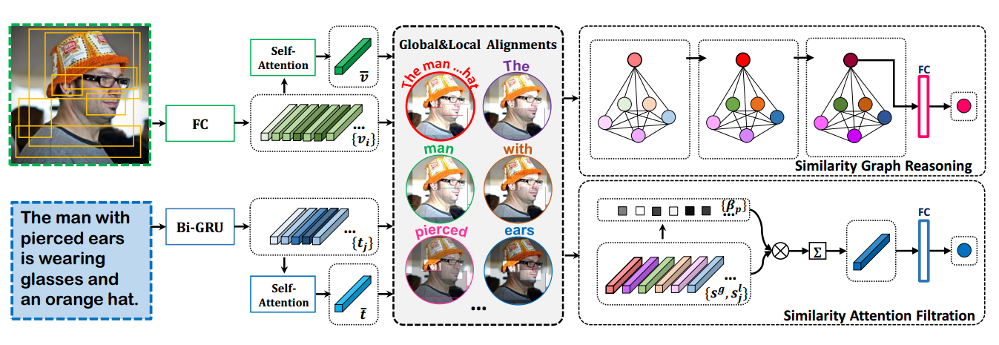  
    - ### Method  
        - 输入  
            - Image: BUTD features, 通过 self-attention 做 Average Pooling 得到全局表示。  
            - Text: BiGRU 得到每个单词的特征，与上述方法一样得到全局表示。  
        - 相似度向量的计算方法（**我认为本文最重要的所在**）  
            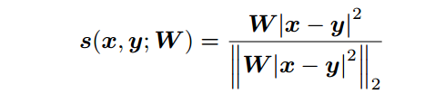  
        - global 相似度  
            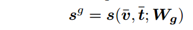  
        - local 相似度（除了相似度的计算方法不同之外，其他和 SCAN 一样，这里用的是对于一个 word 去 attend regions）  
            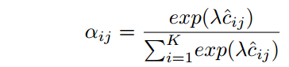  
            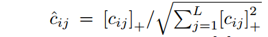  
            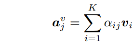  
            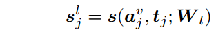  
        - 构图：相似度向量为图的结点，边通过如下表示：  
            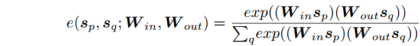  
        - 图的更新过程如下：  
            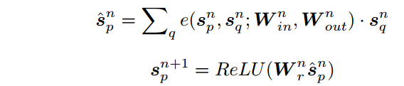  
        - 将最后一步的表示全局相似度的向量过一个FC层得到最终的相似度。  
        - 文本中每个单词的贡献是不一样的，文章中给无意义的单词分配了较低的权重，然后将权重如对应的相似度向量加权求和，再过FC层就得到SAF这一路的最终相似度，权重计算方式如下：  
            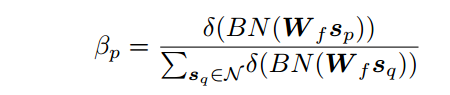  
        - 文中提出，SGR 和 SAF 分开训练效果更好。  

- ## Continuous Updating...  