# Paper Summary  

- ## (*ECCV2018_SCAN*) Stacked Cross Attention for Image-Text Matching. [[paper](https://openaccess.thecvf.com/content_ECCV_2018/papers/Kuang-Huei_Lee_Stacked_Cross_Attention_ECCV_2018_paper.pdf)]  
    - ### 思路  
        首先对图片中的区域(region)和句子中的单词(word)进行编码并将它们映射到相同的嵌入空间(embedding space)，然后通过Stacked Cross Attention 进行regions和words的对齐，求出图片和句子的相似度。  
    - ### Motivation  
        先前的工作大多是先求出图片中的每个region和句子中的每个word的相似度，然后将结果聚合起来作为图片和句子的相似度，但不同的区域或单词的重要程度是不一样的。本文最大的创新/贡献就是引入了Stacked Cross Attention机制，使用regions和words互为上下文进行attention操作，来考虑不同区域或单词的重要程度。  
    - ### Stacked Cross Attention  
        本文给出了两种SCA方案：Image-Text SCA 和 Text-Image SCA，此处主要介绍 Image-Text SCA.  
        SCAN有两个输入：图片特征V={v1, ..., vk}和句子特征E={e1, ..., en}，其中vi表示图片第i个region的特征，ej表示句子第j个单词的特征，vi和ej维度相同。  
        - #### Image-Text Stacked Cross Attention  
              
            - ##### 第一阶段：以图像区域作为上下文来attend句子中的单词  
                计算每一个region和每一个word的余弦相似度：  
                  
                对相似度矩阵进行归一化处理：  
                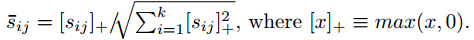  
                计算对于图片中的第i个区域，句子中的第j个单词在整个句子中的重要程度，即注意力分数：  
                 注：λ1为softmax函数[温度参数](https://zhuanlan.zhihu.com/p/132785733)的倒数。  
                对句子中的所有单词加权求和得到句子向量，得到的句子向量就考虑了每个单词的重要程度：  
                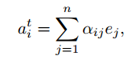  
            - ##### 第二阶段：以句子作为上下文来attend图片中的区域  
                计算图片中的每个区域和其对应的句子向量之间的相似度：  
                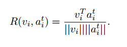  
            - ##### 计算整张图片和整个句子的相似度  
                文中给出了LogSumExp pooling(LSE)和average pooling(AVG)两种方式计算图片和句子的相似度，分别为：  
                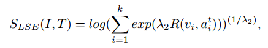  
                  
                注：LSE中的λ2用来提高 R大的项的重要性，当 λ2 → 无穷大时，S(I, T)就近似等于最大的R.  
        - #### Text-Image Stacked Cross Attention  
            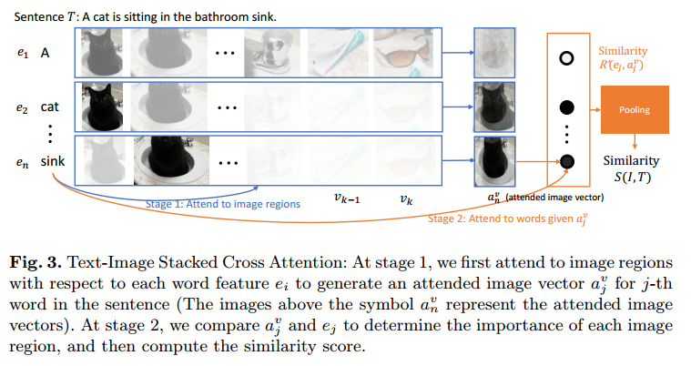  
            与第一种方案类似，不再赘述。  
    - ### Alignment Objective  
        使用[triplet loss](https://www.bilibili.com/video/BV1SW411G7Yg?p=39)作为总的损失函数来训练模型：  
          
        负样本的选取方式如下：  
        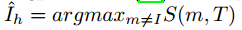 &nbsp;   
        即选取除了当前正例之外相似度最高的图或文作为负样本。  
    - ### 特征提取  
        图片特征：Faster R-CNN + ResNet-101  
        文本特征：bidirectional GRU  

- ## (*ACMMM2019_BFAN*) Focus Your Attention: A Bidirectional Focal Attention Network for Image-Text Matching. [[paper](https://arxiv.org/pdf/1909.11416.pdf)]  
    - ### Motivation  
        之前的工作中都是计算每个region-word的注意力分数，但忽略了实际上存在着许多语义不相关的region-word这一事实(比如图片有一个region是一个狗头，它和单词cat就是不相关的)。而在之前的方法中，语义不相关的region-word也会有一个注意力得分，虽然它得到的注意力很少，但或多或少都会影响最终结果，造成语义不对等现象。为了解决这个问题，本文提出了BFAN，排除语义不相关的region-word的注意力，把所有的注意力全部都转移到语义相关的region-word上。  
          
    - ### Bidirectional Focal Atention Network  
        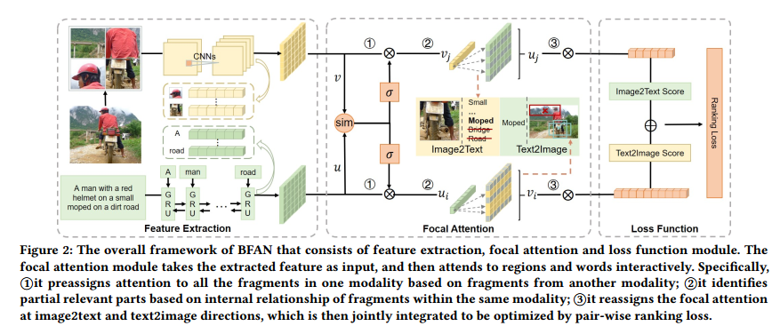  
        - #### Text-to-Image Focal Attention  
            1. 预分配注意力：对于句子中的一个单词，去计算图片中的每一个区域和该单词的相似度，并基于此得到每个区域的注意力分数；  
            2. 根据图片的每个区域得到的注意力分数，决定排除哪些区域(被排除的区域被认为和该单词语义不相关)；  
            3. 重新分配注意力：对留下的区域(被认为和该单词语义相关)重新分配注意力。  
        - #### Image-to-Text Focal Attention  
            与前者类似，不再赘述。  

- ## (*IJCAI2019_PFAN*) Position Focused Attention Network for Image-Text Matching. [[paper](https://arxiv.org/ftp/arxiv/papers/1907/1907.09748.pdf)]  
    - ### Motivation  
        每个region在图片中的相对位置对于理解图片语义有一定的帮助，一般来说图片中间的region可能比边缘的region更能表达图片的主要语义(如下图a)，但这也不是绝对的(如下图b)，所以如果只简单地将注意力着重分配到靠中间的region并不合理。基于以上观察，本文提出为每个region设置一个位置特征来融合其在图片中的相对位置信息，并提出一种注意力机制来为每个region生成实值的位置特征。  
        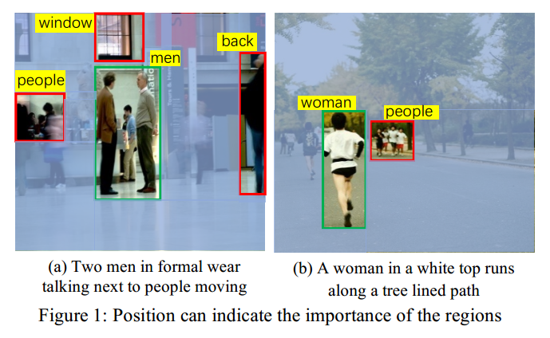  
    - ### PFAN整体架构  
        除了Position Focused Attention之外，其余部分与SCAN一样。  
        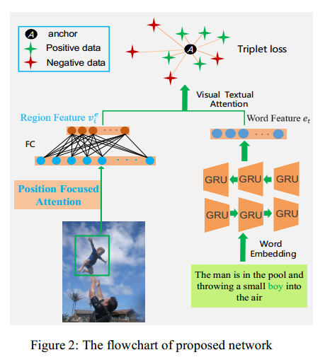  
    - ### 如何编码region的位置信息  
        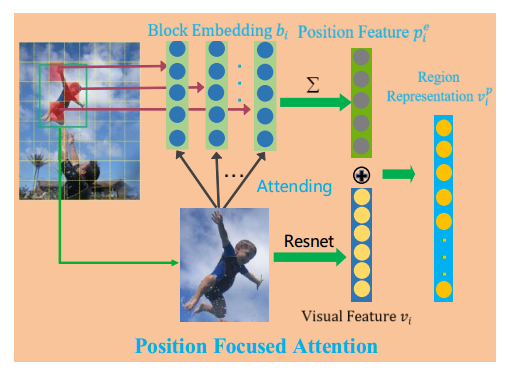  
        1. 将整张图片分成K*K个blocks，每个block都有一个索引编号k，k∈[1, K2]，K2个blocks构成一个词典，每个block用one-hot表示，经过Embedding后得到block embedding；  
        2. 对于图片的某个region，找到前L个与其重叠最多的block，重叠的像素的数量视为这个block的重要程度(注意力分数/权重)；  
        3. 但在某一个region内，某些block会被完全覆盖，导致这几个block的权重相同，但我们希望每一个block的权重都互不相同以获得更加细粒度的信息，所以重新计算每个block的权重，最后将这L个blocks加权求和就得到对应region的位置编码。  

- ## (*AAAI2020_DP-RNN*) Expressing Objects just like Words: Recurrent Visual Embedding for Image-Text Matching. [[paper](https://arxiv.org/pdf/2002.08510.pdf)]  
    - ### Motivation  
        在之前的工作中都是仅考虑了图片中的单个object和句子文本的关系，而本文考虑到，有时图片中的多个objects之间是有关联的，要对这些相互关联的objects联合建模才能确定其与句子文本的关系。如在下图中，要联合这些绿框框起来的objects的语义，才能确定图上是"Two people"，从而达到更好的图文匹配效果。  
        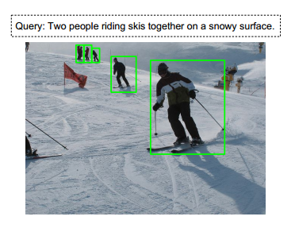  
    - ### Method  
        本文提出Dual Path Recurrent Neural Network(DP-RNN)，以RNN分别处理图像和文本特征，故称为双路RNN。**本文最大的创新点在于用RNN来处理图像特征，关联起了图像的regions之间的关系。**  
        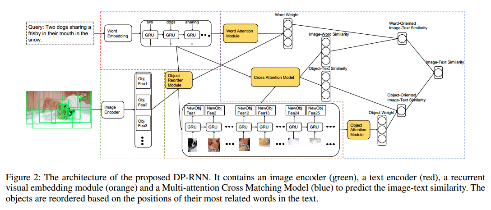  
        **Cross Matching with Multi-attention**: 该过程总体与SCAN一致，只是额外计算了一个"word attention"和"object attention"，最后计算图文相似度的时候要用其进行加权，具体看论文。
        **Recurrent Visual Embedding**: 对图片的regions根据其各自最相关的word在句子中的位置进行重排序(该过程要在"word attention"之后才能做)，然后将重排序好的regions输入到RNN(Bi-GRU)中，每个GRU单元的输出作为新的region feature(目的是为了建模regions之间的关联)。
    - ### 训练策略
        多阶段训练：第一阶段训练Multi-attention Cross Matching部分；第二阶段将Recurrent Visual Embedding加到网络中，训练这一部分，而第一阶段训练好的参数不动；第三阶段训练整个网络，更新所有参数。